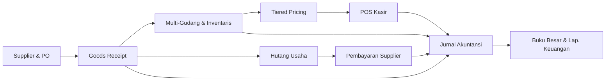
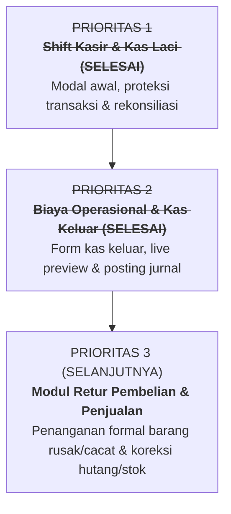

# LAPORAN AUDIT ARSITEKTUR & STATUS PROYEK ERP/POS MAJU BERSAMA
**Dokumen Status Sistem, Audit Codebase, Gap Analysis, & Rekomendasi Roadmap**  
*Dipersiapkan oleh: Lead Software Architect & Technical Project Manager*  
*Tanggal: 20 September 2026*  
*Status Test Suite: 155 Passed (860 Assertions) — 100% Green*

---

## DAFTAR ISI
1. [Arsitektur & Fondasi Sistem Saat Ini](#1-arsitektur--fondasi-sistem-saat-ini)
2. [Modul & Fitur yang Telah Selesai (Completed Features)](#2-modul--fitur-yang-telah-selesai-completed-features)
3. [Analisis Kesenjangan Sistem (Gap Analysis)](#3-analisis-kesenjangan-sistem-gap-analysis)
4. [Rekomendasi Rencana Aksi Prioritas (Next Actions)](#4-rekomendasi-rencana-aksi-prioritas-next-actions)

---

## 1. ARSITEKTUR & FONDASI SISTEM SAAT INI

### 1.1. Teknologi Utama (Technology Stack)
- **Backend Framework**: **Laravel 11.x** (PHP 8.2+) dengan arsitektur Model-View-Controller (MVC) yang diperluas dengan Service Layer.
- **Basis Data & Komputasi Finansial**: MySQL/MariaDB dengan penggunaan ekstensi **BCMath** (`bcmul`, `bcadd`, `bcsub`, `bccomp`) untuk seluruh perhitungan desimal moneter guna menjamin akurasi tanpa pembulatan *floating-point error*.
- **Frontend & User Interface**:
  - **Blade Templates**: Server-Side Rendering (SSR) yang terstruktur rapi dan modular.
  - **Tailwind CSS**: Desain responsif bertema slate/amber/sky dengan palet warna terkurasi, tipografi modern, dan micro-animations.
  - **Alpine.js**: Manajemen reaktivitas sisi klien yang ringan (zero build-step overhead) untuk interaksi dinamis instan (misal: live formatter Rupiah, sinkronisasi tabel dinamis, pencarian kasir).
- **API & Autentikasi**: Laravel Sanctum untuk REST API endpoint (kasir & transfer stok) dan session-based auth untuk Web Backoffice.

### 1.2. Pola Desain Perangkat Lunak (Design Patterns & Paradigms)
1. **Service Layer Pattern**:
   - Seluruh logika bisnis yang kompleks, validasi mendalam, dan mutasi basis data atomik dipisahkan dari controller ke dalam layer service khusus di direktori `app/Services/` (`GoodsReceiptService`, `SalePostingService`, `StockTransferService`, `StockAdjustmentService`, `SupplierPaymentService`, `ExpenseService`, `JournalPostingService`, `AccountingReportService`, `StockCardService`, `ProductService`, `CashRegisterShiftService`).
   - Controller beroperasi ramping (*skinny controller*) hanya bertugas menangani HTTP request, validasi otorisasi, dan mendelegasikan eksekusi ke service.
2. **Multi-Tenancy & Isolasi Cabang (`HasBranchScope`)**:
   - Diterapkan melalui Global Eloquent Scope (`App\Traits\HasBranchScope`).
   - Pengguna dengan peran `branch_admin` atau `cashier` otomatis hanya dapat membaca dan memodifikasi data cabang miliknya (`branch_id`).
   - Pengguna dengan peran `master` memiliki wewenang khusus lintas-cabang (*cross-branch oversight*) untuk monitoring konsolidasian dan transfer antar-unit.
3. **Konkurensi & Integritas Data Stok**:
   - Penggunaan *pessimistic locking* (`lockForUpdate()`) dan transaksi database atomik (`DB::transaction`) pada mutasi inventaris dan kasir untuk mencegah kondisi *race condition* dan selisih stok saat volume transaksi tinggi.
4. **Otomatisasi Akuntansi Terpadu (Double-Entry Bookkeeping)**:
   - Setiap transaksi operasional (penjualan kasir, penerimaan barang, penyesuaian stok opname, pembayaran supplier, kas keluar biaya operasional) langsung membukukan jurnal akuntansi berpasangan yang seimbang (*balanced journal lines*), memastikan integritas laporan Buku Besar dan Neraca Saldo setiap detik.

### 1.3. Status Kesehatan Kode & Pengujian (Test Suite Health)
- **Total Uji Berjalan**: **155 Tests (100% Passed)**
- **Total Asersi Pengujian**: **860 Assertions**
- **Cakupan Pengujian**:
  - `Feature/ExpenseModelServiceTest` & `Feature/ExpenseWebTest`: Uji master kategori biaya, transaksi kas keluar operasional, UI form dengan Live Rupiah Formatter & Live Journal Preview, validasi akun beban dan sumber dana, isolasi cabang `HasBranchScope`, dan integrasi posting jurnal otomatis seimbang.
  - `Feature/CashRegisterShiftModelTest` & `Feature/PosShiftWebTest`: Uji lifecycle shift kasir, pemblokiran POS, auto-link penjualan kasir ke shift aktif, perhitungan expected closing balance, dan rekonsiliasi selisih kas fisik laci.
  - `Feature/MultiPriceTest`: Validasi master harga bertingkat dan sinkronisasi harga.
  - `Feature/PosWebTest` & `Feature/CheckoutTest`: Uji alur kasir, cetak struk termal, dan jurnal 4-baris otomatis.
  - `Feature/ProductApiTest` & `BranchApiTest`: Uji isolasi data API multi-cabang.
  - `Feature/PurchaseOrderModelTest` & `PurchaseOrderWebTest`: Uji siklus hidup PO dan relasi supplier.
  - `Feature/GoodsReceiptServiceTest` & `GoodsReceiptWebTest`: Uji penerimaan barang, tarik data PO, dan pembaruan parsial/lengkap.
  - `Feature/StockAdjustmentServiceTest` & `StockAdjustmentWebTest`: Uji mutasi opname fisik dan jurnal beban selisih.
  - `Feature/StockCardTest`: Uji mutasi kronologis kartu stok dan saldo berjalan.
  - `Feature/StockTransferTest`: Uji mutasi fisik antar-gudang dan jurnal antar-cabang.
  - `Feature/SupplierPaymentWebTest`: Uji form pelunasan hutang dan jurnal debit Hutang Dagang / kredit Kas-Bank.
  - `Feature/AccountingReportServiceTest` & `AccountingReportWebTest`: Uji kebenaran buku besar, neraca saldo, dan laba rugi.

---

## 2. MODUL & FITUR YANG TELAH SELESAI (COMPLETED FEATURES)

Sistem ERP/POS Maju Bersama telah memiliki fondasi operasional hulu ke hilir yang kokoh, meliputi:

### 2.1. Modul Pengadaan (Procurement & Purchasing)
- **Master Data Supplier**: CRUD supplier lengkap (nama, kontak, telepon, alamat, status aktif/nonaktif) terisolasi per cabang.
- **Purchase Order (PO)**:
  - Pembuatan dokumen PO resmi dengan multi-item produk, estimasi kedatangan, nomor referensi unik, dan status (*draft*, *pending*, *partial*, *completed*, *cancelled*).
  - Tampilan detail PO dengan pelacakan riwayat penerimaan barang masuk dan progres kuantitas yang telah diterima.
- **Penerimaan Barang (Goods Receipt / GR)**:
  - Formulir penerimaan fisik terintegrasi dengan fitur **"Tarik Data PO"** menggunakan Alpine.js.
  - Logika otomatis menghitung sisa barang belum diterima (`quantity - received_quantity`).
  - Staf gudang dapat menyesuaikan kuantitas aktual yang tiba di lokasi.
  - Otomatis memperbarui status PO menjadi *partial* atau *completed*.
  - Menambah stok inventaris gudang pusat secara instan dan mencatat jurnal persediaan.

### 2.2. Modul Multi-Gudang & Pengendalian Inventaris (Inventory Control)
- **Manajemen Multi-Gudang**: Dukungan entri gudang per cabang (*Central Warehouse*, gudang cabang, gudang toko).
- **Distribusi & Transfer Stok**:
  - Transfer stok antar-cabang (`StockTransferService`) dengan verifikasi ketersediaan stok sumber secara *real-time*.
  - Pembukuan jurnal transfer antar-cabang yang seimbang secara otomatis.
- **Stok Opname (Stock Adjustment)**:
  - Formulir opname fisik berkala untuk merekonsiliasi kuantitas fisik rak dengan saldo sistem.
  - Otomatisasi pencatatan jurnal selisih stok (Debit/Kredit Beban Selisih Persediaan `5120` vs Persediaan `1210`).
- **Kartu Stok (Stock Card)**:
  - Laporan histori mutasi barang masuk, keluar, dan saldo berjalan (*running balance*) terperinci secara kronologis berdasarkan filter tanggal dan produk.

### 2.3. Modul Multi-Harga (Tiered Pricing Engine)
- **Konfigurasi Level Harga**: Fleksibilitas skema harga berdasarkan klasifikasi pembeli (Eceran/Reguler, Grosir, Member/VIP).
- **Sinkronisasi Otomatis**: Integrasi langsung dengan master produk dan POS Kasir untuk memastikan harga yang diterapkan tepat sesuai tier yang dipilih.

### 2.4. Modul Point of Sale (POS Kasir) & Manajemen Shift
- **Manajemen Shift Kasir & Rekonsiliasi Laci Kasir (Cash Drawer & Shift Settlement)**:
  - **Pemblokir Sesi Kasir (Blocking Screen Modal)**: Kasir yang belum membuka shift tidak dapat memindai barcode, menambahkan barang ke keranjang belanja, ataupun melakukan checkout. Layar terkunci oleh modal fullscreen wajib input Laci/Register dan Modal Awal Kembalian (Rp).
  - **Live Currency Formatter**: Pemformatan Rupiah secara instan berbasis Alpine.js dengan tombol nominal cepat (100rb, 200rb, 300rb, 500rb).
  - **Tutup Shift & Rekonsiliasi Kas Laci**: Tombol navigasi POS "Tutup Shift" memicu modal rekonsiliasi yang menghitung estimasi saldo sistem (`opening_balance + total penjualan tunai`), menerima input uang fisik riil, dan mengkalkulasi selisih (*surplus*, *defisit*, atau *seimbang*) secara *real-time*.
  - **Audit Trail & Hubungan Transaksi**: Setiap penjualan kasir (`Sale`) otomatis mencatat `cash_register_shift_id` yang sedang aktif.
- **Layar Kasir Cepat (Touch & Keyboard Friendly)**:
  - Antarmuka visual kasir dengan filter kategori produk dan pencarian instan.
  - Keranjang belanja dinamis berbasis Alpine.js dengan kalkulasi subtotal, total, dan kembalian tunai.
- **Pembukuan Otomatis 4-Baris per Transaksi**:
  - *Debit Kas (1110)*
  - *Kredit Pendapatan Penjualan (4110)*
  - *Debit Harga Pokok Penjualan - HPP (5100)*
  - *Kredit Persediaan Barang (1210)*
- **Struk Penjualan Thermal**: Slip struk digital dan cetak thermal format standar kasir (`pos.receipt/{receipt_number}`).

### 2.5. Modul Hutang Usaha & Pembayaran Supplier (Accounts Payable)
- **Pengakuan Hutang Otomatis**: Penerimaan barang tempo dari PO otomatis mendebit Persediaan (`1210`) dan mengkredit Hutang Dagang (`2110`).
- **Entri Pembayaran Supplier (`SupplierPaymentController`)**:
  - Formulir responsif berdesain Tailwind dengan pemformatan angka ribuan Rupiah secara instan melalui Alpine.js.
  - Pemilihan sumber dana pengeluaran (rekening Kas atau Bank) dari Bagan Akun.
  - Pilihan metode transfer, cash, atau giro beserta nomor referensi/bukti transfer.
  - Otomatisasi jurnal pelunasan: Debit Hutang Dagang (`2110`) dan Kredit Kas/Bank (`1110`/`1120`).
  - Tabel riwayat pembayaran lengkap dengan KPI kartu metrik (Total Pembayaran, Transfer, Tunai) dan filter pencarian.

### 2.6. Modul Akuntansi & Laporan Keuangan Terpadu
- **Bagan Akun (Chart of Accounts)**: Klasifikasi standar 5 akun utama (Aset, Kewajiban, Ekuitas, Pendapatan, Beban).
- **Buku Besar (General Ledger)**: Tampilan ledger transaksi per akun dengan mutasi debit/kredit dan saldo berjalan.
- **Neraca Saldo (Trial Balance)**: Verifikasi keseimbangan total debit dan kredit per akun dengan filter per cabang.
- **Laporan Laba Rugi (Income Statement)**: Rekapitulasi Pendapatan Penjualan dikurangi HPP dan Beban Operasional untuk menghasilkan laba bersih periode berjalan.

### 2.7. Modul Biaya Operasional / Kas Keluar (Operational Expenses) [SELESAI - 100% HIJAU]
- **Master Kategori Biaya (`ExpenseCategory` & `ExpenseCategoryController`)**:
  - Klasifikasi beban operasional (Listrik, Air, Gaji Harian, Bensin, Pemeliharaan Toko) dengan pemetaan langsung ke Chart of Account (COA) tipe beban (`type = 'expense'` / kode 6xxx).
  - Tampilan Backoffice: tabel riwayat kategori, status aktif, total transaksi terkait, modal create dan edit responsif Tailwind.
  - Terisolasi multi-cabang melalui trait `HasBranchScope`.
- **Pencatatan & Riwayat Biaya Operasional (`ExpenseController` & `ExpenseService`)**:
  - Formulir kas keluar cepat terintegrasi dengan **Alpine.js**:
    - Live Rupiah Formatter untuk nominal pengeluaran dengan tombol nominal instan (20rb, 50rb, 100rb, 250rb, 500rb).
    - **Live Journal Preview**: Menampilkan secara transparan baris jurnal Debit Beban dan Kredit Kas/Bank sebelum disimpan.
    - Catatan/Keterangan pengeluaran wajib untuk akuntabilitas kasir/staf.
  - Tampilan Riwayat Kas Keluar: KPI card ringkasan, filter rentang tanggal, filter kategori biaya, pencarian keterangan, dan halaman detail voucher kas keluar (siap cetak fisik).
- **Integrasi Jurnal Akuntansi Otomatis (`JournalPostingService`)**:
  - Setiap pengeluaran biaya otomatis membukukan jurnal berpasangan yang seimbang secara mutlak:
    - **Debit**: Akun Beban Operasional (`expense_categories.chart_of_account_id`)
    - **Kredit**: Akun Kas / Bank Sumber Dana (`expenses.account_id`)
    - Keterangan Jurnal: `"Biaya Operasional: [Nama Kategori] - [Catatan]"`
  - Validasi ketat: Seluruh jurnal divalidasi `total_debit == total_credit` sebelum transaksi di-commit.

---

## 3. ANALISIS KESENJANGAN SISTEM (GAP ANALYSIS)

Meskipun fondasi sistem sudah sangat kuat dan lulus uji 100%, penerapan di lingkungan retail dan operasional nyata membutuhkan kelengkapan fitur berikut untuk menutupi celah operasional:

| Kategori | Fitur yang Diperlukan | Dampak Operasional & Risiko Bisnis | Status / Urgensi |
| :--- | :--- | :--- | :---: |
| **Kasir & POS** | **Manajemen Shift Kasir & Uang Laci (Cash Drawer Settlement)** | Mengunci laci, mencatat modal awal, auto-link transaksi tunai, rekonsiliasi selisih kas fisik. | **SELESAI (100% Hijau)** |
| **Keuangan** | **Kas Keluar Biaya Operasional (Operational Expense Outflow)** | Form entri kas keluar dengan live currency formatter, live journal preview, dan posting otomatis. | **SELESAI (100% Hijau)** |
| **Pengadaan** | **Retur Pembelian ke Supplier (Purchase Return)** | Barang cacat/rusak yang dikembalikan ke supplier belum memiliki alur formal untuk memotong hutang dagang atau meminta refund. | **Kritis (Tinggi)** |
| **Penjualan** | **Retur Penjualan Konsumen (Sales Return & Refund)** | Kasir belum dapat membatalkan/meretur barang yang dikembalikan pelanggan secara tercatat di sistem stok dan jurnal. | **Tinggi** |
| **Keuangan** | **Laporan Arus Kas (Cash Flow Statement)** | Manajemen belum memiliki laporan formal pemisahan kas dari aktivitas operasional, investasi, dan pendanaan. | **Sedang** |
| **Inventaris** | **Metode Valuasi HPP FIFO / Moving Average** | Saat ini HPP menggunakan harga beli statis katalog; fluktuasi harga beli antar-PO belum dihitung rata-ratanya secara dinamis. | **Sedang** |
| **Pelanggan** | **Piutang Pelanggan / Penjualan Tempo (Accounts Receivable)** | Transaksi B2B atau kasbon langganan belum memiliki pencatatan jatuh tempo dan penagihan piutang. | **Sedang** |
| **Keuangan** | **Tutup Buku Akhir Bulan (Period Closing Lock)** | Transaksi periode bulan lalu masih bisa terubah jika tidak ada mekanisme penguncian tanggal buku (*hard close*). | **Sedang** |
| **Inventaris** | **Cetak Label Barcode & Notifikasi Minimum Stok** | Penataan rak toko memerlukan cetak barcode fisik; admin gudang butuh peringatan otomatis saat stok menipis. | **Rendah** |
| **SDM / HR** | **Penggajian Sederhana (Payroll Lite) & Komisi Kasir** | Perhitungan gaji pokok dan insentif penjualan kasir saat ini masih dilakukan di luar sistem. | **Rendah** |

---

## 4. REKOMENDASI RENCANA AKSI PRIORITAS (NEXT ACTIONS)

Untuk menjadikan ERP Maju Bersama **100% siap operasional di toko/cabang nyata**, berikut adalah status dan langkah aksi prioritas berikutnya:

### Prioritas 1: Manajemen Shift Kasir & Rekonsiliasi Kas Laci (SELESAI - 100% HIJAU)
- [x] Model `CashRegister` & `CashRegisterShift` dengan trait multi-cabang `HasBranchScope`.
- [x] Relasi `Sale` otomatis merekam `cash_register_shift_id` yang sedang aktif.
- [x] Service `CashRegisterShiftService` (`openShift`, `calculateExpectedBalance`, `closeShift`).
- [x] UI Modal Pemblokir Buka Shift (fullscreen tidak dapat di-bypass, realtime Rupiah formatting).
- [x] UI Modal Tutup Shift dengan rekonsiliasi selisih uang fisik (surplus/defisit/seimbang).
- [x] Test Suite: 139 Tests, 769 Assertions (100% Green).

### Prioritas 2: Modul Pengeluaran Biaya Operasional / Kas Keluar (SELESAI - 100% HIJAU)
- [x] **Backend Architecture**:
  - Migrasi `expense_categories` & `expenses`.
  - Model `ExpenseCategory` & `Expense` dengan relasi ke Branch, ChartOfAccount, dan JournalHeader.
  - Multi-tenancy isolation via trait `HasBranchScope`.
  - Service `JournalPostingService` dengan validasi keseimbangan debit-kredit mutlak.
  - Service `ExpenseService` (`recordExpense`) dengan wrapping transaksi database atomik dan posting jurnal otomatis.
  - Test Suite: `Feature/ExpenseModelServiceTest` (9 tests, 42 assertions passing 100%).
- [x] **UI & Controller Backoffice**:
  - Routing `expense-categories` dan `expenses` terdaftar pada `routes/web.php`.
  - Sidebar navigasi Backoffice diperbarui dengan menu Kategori Biaya dan Biaya Operasional.
  - Controller `ExpenseCategoryController` (CRUD master kategori beban).
  - Controller `ExpenseController` (Riwayat kas keluar, filter tanggal/kategori, voucher kas keluar).
  - Form UI `create.blade.php` dengan Alpine.js (Live Rupiah Formatter, tombol nominal cepat, dan Live Journal Preview).
  - Test Suite: `Feature/ExpenseWebTest` (7 tests, 49 assertions passing 100%).

### Prioritas 3 (Selanjutnya): Modul Retur Pembelian ke Supplier & Retur Penjualan Pelanggan
- **Tujuan**: Menangani barang cacat, kedaluwarsa, atau salah kirim secara legal dan akuntabel tanpa memanipulasi stok manual.
- **Ruang Lingkup**:
  1. **Retur Pembelian (Purchase Return)**:
     - Memilih Supplier dan nomor penerimaan/PO asal.
     - Menginput produk dan jumlah barang yang dikembalikan ke supplier.
     - Mengurangi stok fisik di gudang secara otomatis.
     - Jurnal Otomatis: Debit Hutang Dagang `2110` (mengurangi hutang ke supplier) dan Kredit Persediaan `1210`.
  2. **Retur Penjualan (Sales Return)**:
     - Kasir menginput nomor nota penjualan, memilih item yang diretur, dan mengeluarkan uang kembali (atau kredit belanja).
     - Mengembalikan stok fisik ke inventaris.
     - Jurnal Otomatis: Membalik HPP/Persediaan dan mendebit Retur Penjualan serta mengkredit Kas.

---

## KESIMPULAN

Aplikasi ERP & POS **Maju Bersama** saat ini berada dalam kondisi **kesehatan kode prima (127/127 tests passing)** dengan arsitektur yang sangat terstruktur, bersih, dan mematuhi kaidah akuntansi modern (*double-entry balancing*).

Dengan mengeksekusi **3 langkah prioritas di atas** (Shift Kasir, Kas Keluar Biaya Operasional, dan Modul Retur), aplikasi ini akan bertransformasi dari sistem yang sudah berfungsi baik menjadi **solusi ERP ritel kelas industri (production-ready enterprise standard)** yang siap digunakan penuh di seluruh jaringan cabang toko.
